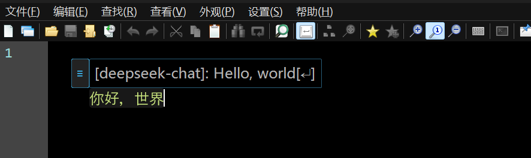

```
████████╗██╗   ██╗██████╗ ██╗███╗   ██╗ ██████╗     ████████╗██████╗  █████╗ ███╗   ██╗███████╗██╗      █████╗ ████████╗██╗ ██████╗ ███╗   ██╗
╚══██╔══╝╚██╗ ██╔╝██╔══██╗██║████╗  ██║██╔════╝     ╚══██╔══╝██╔══██╗██╔══██╗████╗  ██║██╔════╝██║     ██╔══██╗╚══██╔══╝██║██╔═══██╗████╗  ██║
   ██║    ╚████╔╝ ██████╔╝██║██╔██╗ ██║██║  ███╗       ██║   ██████╔╝███████║██╔██╗ ██║███████╗██║     ███████║   ██║   ██║██║   ██║██╔██╗ ██║
   ██║     ╚██╔╝  ██╔═══╝ ██║██║╚██╗██║██║   ██║       ██║   ██╔══██╗██╔══██║██║╚██╗██║╚════██║██║     ██╔══██║   ██║   ██║██║   ██║██║╚██╗██║
   ██║      ██║   ██║     ██║██║ ╚████║╚██████╔╝       ██║   ██║  ██║██║  ██║██║ ╚████║███████║███████╗██║  ██║   ██║   ██║╚██████╔╝██║ ╚████║
   ╚═╝      ╚═╝   ╚═╝     ╚═╝╚═╝  ╚═══╝ ╚═════╝        ╚═╝   ╚═╝  ╚═╝╚═╝  ╚═╝╚═╝  ╚═══╝╚══════╝╚══════╝╚═╝  ╚═╝   ╚═╝   ╚═╝ ╚═════╝ ╚═╝  ╚═══╝
```

# Real-time Translation Typing - LLM Edition




## 项目说明
- 本项目fork自[sxzxs/Real-time Translation Typing](https://github.com/sxzxs/Real-time-translation-typing)，只是将项目改成了由大语言模型驱动的版本，主要功能归功于于原开发者
- 所有的更改通过在Claude Code中配置了GLM-4.7后Vibe Coding而成，我自己不会编程
- 所有的LOL功能原项目本身存在，我自己不玩所以***无法确认效果***
- 绝大部分技术说明也由AI直接生成，请仔细甄别
- 请注意隐私，如有需求请自行配置本地大模型

## 原功能

* 实时打字翻译 （转为大语言模型驱动）
* 编程命名转换

## 功能变化
`+` 增加了目标语言切换功能，可自行输入想要翻译成的目标语言
`+` 可以拖动输入窗口，以防止输入位置靠边导致输入窗口显示不全的问题
`+` 更直观的操作设计
`-` 去掉了原来传统翻译服务的功能(包括网页和API)
`-` 去掉了对应的语音相关功能，现在已有更好用的AI方式
`?` LOL 内部功能未修改，但不确定可行性
 

## ⚠️ 重要提示

**本版本需要配置OpenAI兼容API才能使用！**
**本软件基于Widnows下的AutoHotKey实现，不兼容其他平台**

### 快速配置（仅需2步）

**步骤1**: 获取API Key
- 选择任何提供OpenAI兼容API的服务（如OpenAI、DeepSeek、智谱AI等）
- 注册并获取API Key

**步骤2**: 填写配置文件
- 运行程序后会自动创建 `config.json`
- 编辑 `config.json`，填写你的API Key和base_url
- 重新运行程序

详细配置说明请参考下方的"配置说明"章节。

## 使用方法

### 🟦 方式一：使用编译版（推荐普通用户）

**适用场景**：没有安装 AutoHotkey，只想使用程序

1. 下载最新版本的发布包（包含 `实时打字翻译.exe` 和 `实时打字翻译.ahk`）
2. 解压到任意目录
3. 双击 `实时打字翻译.exe` 运行
4. 首次运行会自动创建 `config.json` 配置文件
5. 编辑配置文件，填入你的 API Key
6. 重新运行程序

**优点**：
- 无需安装 AutoHotkey
- 开箱即用
- 适合大多数用户

**注意**：
- `实时打字翻译.exe` 是预编译的解释器，会自动运行同目录下的 `.ahk` 文件
- 当 `.ahk` 代码更新时，只需替换 `.ahk` 文件，`.exe` 无需重新编译

---

### 🟩 方式二：使用源码版（推荐开发者）

**适用场景**：已安装 AutoHotkey，想查看/修改源代码

**前提条件**：
- 已安装 [AutoHotkey v2+](https://github.com/thqby/AutoHotkey_H/releases)（推荐使用 AutoHotkey_H v2 增强版）

**运行方式**（任选其一）：
1. 双击 `实时打字翻译.ahk` 文件
2. 将 `实时打字翻译.ahk` 拖拽到 `AutoHotkey.exe` 上
3. 或右键 `.ahk` 文件 → "Run Script"

**优点**：
- 可以查看和修改源代码
- 方便调试和开发
- 实时查看代码更改

## 快捷键

### 通用快捷键
* `ALT Y`: 打开翻译器
* `ALT L`: 修改目标翻译语言
* `ENTER`: 输出翻译文本
* `CTRL ENTER`: 输出原始文本
* `CTRL C`: 复制翻译结果
* `CTRL V`: 粘贴剪贴板内容
* `CTRL ALT ENTER`: 转换为Snake命名 (`variable_name`)
* `SHIFT ALT ENTER`: 转换为驼峰命名 (`VariableName`)
* `ESC`: 退出
* `TAB`: 切换翻译服务
* `CTRL F7`: 显示当前API配置信息

## 环境要求

| 环境 | 版本 |
|------|------|
| 系统 | Windows 10 或更高版本 |
| 源码运行需要AHK版本 | [AutoHotkey v2+](https://github.com/thqby/AutoHotkey_H/releases) |
| 网络连接 | 需要稳定的网络连接访问LLM API |


## 配置说明

通过配置文件配置 `config.json`

### 基本结构

```json
{
    "cd": "service1",
    "target_lang": "English",
    "all_api": ["service1", "service2"],

    "service1": {
        "display_name": "OpenAI GPT",
        "is_open": 1,
        "is_real_time_translate": 1,
        "api_key": "sk-你的API密钥",
        "base_url": "https://api.openai.com/v1",
        "model": "gpt-4o-mini",
        "debounce_delay": 500,
        "temperature": 0.3,
        "max_tokens": 2000
    }
}
```

**首次运行**：程序会自动从 `config.example.json` 复制创建 `config.json`，无需手动创建。

### 配置项说明

| 配置项 | 说明 | 示例 | 必填 |
|--------|------|------|------|
| `cd` | 当前使用的服务配置名 | `"service1"` | ✅ |
| `target_lang` | 目标翻译语言 | `"en"` (英语), `"ja"` (日语) 等 | ❌ (默认English) |
| `all_api` | 所有可用的配置名列表 | `["service1", "service2"]` | ✅ |
| `display_name` | 服务显示名称（界面显示用） | `"OpenAI GPT"`, `"智谱AI"` | ❌ (默认使用配置名) |
| `is_open` | 是否启用该服务 | `1` 或 `0` | ✅ |
| `is_real_time_translate` | 是否实时翻译 | `1` 或 `0` | ✅ |
| `api_key` | API密钥 | 从服务获取 | ✅* |
| `base_url` | API地址（必须为OpenAI兼容格式） | 必须包含`/v1` | ✅ |
| `model` | 模型名称 | 按服务文档填写 | ✅ |
| `debounce_delay` | 防抖延迟(毫秒) | `500` = 停止0.5秒后翻译 | ❌ (默认500) |
| `temperature` | 温度参数 | `0.3` = 更确定性的输出 | ❌ (默认0.3) |
| `max_tokens` | 最大token数 | `2000` | ❌ (默认2000) |

*注：部分本地服务可能不需要API Key，可填任意值

### 添加新服务（只需3步，无需改代码！）

**前提条件**: 该服务必须提供OpenAI兼容的API接口

**步骤1**: 在 `all_api` 中添加配置名
```json
"all_api": ["service1", "new-service"]
```

**步骤2**: 添加配置块
```json
"new-service": {
    "display_name": "新服务名称",
    "is_open": 1,
    "api_key": "从服务获取的密钥",
    "base_url": "https://api.service-name.com/v1",
    "model": "model-name",
    "debounce_delay": 500
}
```

**步骤3**: 设置为默认服务（可选）
```json
"cd": "new-service"
```

**完成！** 无需修改任何代码，程序会自动识别并加载。

### 常见服务配置示例

| 服务类型 | base_url示例 | 获取方式 |
|---------|--------------|----------|
| **OpenAI官方** | `https://api.openai.com/v1` | https://platform.openai.com |
| **其他OpenAI兼容服务** | 按服务商文档填写 | 查看该服务文档的"OpenAI兼容"说明 |
| **本地部署** | `http://localhost:11434/v1` | 本地安装Ollama等 |

**重要提示**：
- 配置前请先确认该服务是否提供OpenAI兼容接口
- 具体base_url和model名称请参考各服务官方文档
- 本项目不对任何第三方服务做兼容性保证

### 切换服务

按 `TAB` 键循环切换配置中已启用的服务。

### 修改目标翻译语言

有两种方式修改目标翻译语言：

**方式1：使用快捷键（推荐）**
- 按 `ALT L` 打开语言设置对话框
- 显示当前目标语言
- 输入新的目标语言名称（如 "Japanese"、"法语"、"Español" 等）
- 确认后自动保存到配置文件

**方式2：修改配置文件**
- 在 `config.json` 中修改 `target_lang` 字段
- 支持任意语言名称（LLM能够理解）
- 重启程序生效

**示例**：
- `"en"` 或 `"English"` - 英语
- `"ja"` 或 `"Japanese"` 或 `"日本語"` - 日语
- `"ko"` 或 `"Korean"` 或 `"한국어"` - 韩语
- `"fr"` 或 `"French"` 或 `"法语"` - 法语

### 编程命名转换（程序员专用）

将翻译结果自动转换为编程语言常用的变量命名格式。

**使用场景**：
- 翻译技术文档时快速提取变量名
- 创建符合规范的类名和函数名
- 跨语言开发时的命名风格转换

**Snake命名**（`CTRL ALT ENTER`）
- 格式: `variable_name`
- 适用: Python、Ruby、Go等
- 示例:
  - 输入: "用户名" → 翻译: "user name" → 转换: `user_name`
  - 输入: "订单管理器" → 翻译: "order manager" → 转换: `order_manager`

**驼峰命名**（`SHIFT ALT ENTER`）
- 格式: `VariableName`（大驼峰/PascalCase）
- 适用: Java、C#、C++类名
- 示例:
  - 输入: "用户名" → 翻译: "user name" → 转换: `UserName`
  - 输入: "订单管理器" → 翻译: "order manager" → 转换: `OrderManager`

**转换规则**：
- 自动转为小写
- 空格替换为下划线（snake）或移除（驼峰）
- 移除所有特殊字符，只保留字母、数字和下划线
- 驼峰命名：每个单词首字母大写

### LOL 语音转文字（游戏内实时翻译）

在LOL游戏内使用翻译功能，方便与国际队友交流。

**前提条件**：
- 需要运行LOL游戏客户端
- 需要安装第三方工具（如LCU API）用于游戏内通信
- zmq服务器需要在 `localhost:5555` 运行

**使用流程**：
1. 在游戏中按 `XButton1` (鼠标侧键1) 打开翻译器
2. 输入要说的话（中文或其他语言）
3. LLM实时翻译成目标语言
4. 按鼠标侧键发送到游戏聊天

**发送模式**（按 `CTRL F8` 切换）：
1. **Simulacrum Code模式**（默认）
   - 使用Unicode编码逐字符输入
   - 兼容性更好，适合大多数系统
   - 速度稍慢

2. **直接发送模式**
   - 通过zmq直接发送到游戏
   - 需要第三方LCU工具支持
   - 速度更快

**快捷键说明**：
- `XButton1`: 打开翻译器输入
- `XButton2`: 发送原始文本（不翻译）
- `ALT XButton2`: 发送所有人聊天 `/all` + 原始文本
- `CTRL XButton2`: 发送所有人聊天 `/all` + 翻译结果
- `SHIFT XButton2`: 发送翻译结果到队伍聊天

**注意事项**：
- LOL功能仅在游戏窗口 `ahk_class RiotWindowClass` 生效
- 需要先配置目标翻译语言（默认为英语）
- 建议使用快速模型（如 `glm-4-flash`）以提高翻译速度

## 性能优化建议

### 1. 调整防抖延迟
如果你打字速度较快，可以增大 `debounce_delay` 到 800-1000 毫秒，以减少API调用次数。

### 2. 选择快速模型
选择响应速度快的模型（如gpt-4o-mini、deepseek-chat）可以提高翻译速度。

### 3. 关闭实时翻译
如果不需要实时翻译，设置 `is_real_time_translate` 为 0，然后按空格键手动触发翻译。

## 成本说明

实时翻译的Token消耗取决于使用频率和所选服务的定价：

| 使用场景 | 每小时Token消耗（估算） | 说明 |
|---------|------------------------|------|
| 轻度使用 | 10,000 | 偶尔使用 |
| 中度使用 | 50,000 | 较频繁使用 |
| 重度使用 | 200,000 | 持续使用 |

**优化建议**：
- 调整 `debounce_delay` 减少请求次数
- 设置 `is_real_time_translate: 0` 改为手动触发
- 选择性价比高的服务

**注意**：具体费用请查看所选LLM服务的官方价格表。

## API Key 安全

- API Key存储在本地配置文件中
- 不会上传到任何服务器
- 建议不要分享你的config文件

## 常见问题

### Q: 为什么只支持OpenAI兼容API？
A: OpenAI格式已成为事实标准，绝大多数LLM服务都提供兼容接口。单一格式大大简化了代码和维护成本。

### Q: 我想用的服务不提供OpenAI兼容接口怎么办？
A:
1. 使用第三方中转服务转换格式
2. 或等待该服务商提供兼容接口
3. 或等待本项目未来扩展支持更多原生格式

### Q: 响应速度会变慢吗？
A: LLM响应通常1-2秒。已添加防抖机制优化体验，也可选择快速模型或关闭实时翻译。

### Q: 可以离线使用吗？
A: 需要网络连接。可配置本地服务（如Ollama）实现较低延迟。

## 故障排除

### 问题1: 翻译失败
**原因**: API Key错误或网络问题
**解决**:
1. 检查API Key是否正确
2. 检查网络连接
3. 检查base_url是否正确
4. 按 `CTRL F7` 查看当前配置信息

### 问题2: 响应速度慢
**原因**: LLM API响应通常需要1-2秒
**解决**:
1. 调整 `debounce_delay` 减少请求频率
2. 选择更快的模型
3. 关闭实时翻译，改手动触发

### 问题3: 启动失败
**原因**: 配置文件错误或未配置API Key
**解决**:
1. 检查 `config.json` 格式是否正确（首次运行会自动创建）
2. 确认至少配置了一个服务且 `is_open` 为 1
3. 确认填写了正确的 `api_key` 和 `base_url`
4. 按 `CTRL F7` 查看当前配置信息

### 问题4: 找不到 config.json
**原因**: 首次运行或配置文件被删除
**解决**:
- 程序会自动从 `config.example.json` 创建 `config.json`
- 确保 `config.example.json` 文件存在
- 重新运行程序即可自动创建

## 版本历史

**v2.2 (窗口移动)**
- ✅ 添加输入窗口移动功能
- ✅ 修复 utility 中关于 LOL 功能未被打包的问题
- ✅ 增加光标功能
- ✅ 修复输入框末尾空格不显示的问题
- ✅ 其他若干小修复

**v2.1 (目标语言功能)**
- ✅ 添加自定义目标翻译语言功能（ALT L）
- ✅ 支持任意语言名称，LLM自动识别
- ✅ 配置文件持久化保存

**v2.0 (LLM版)**
- ✅ 使用LLM API进行翻译，翻译质量更高
- ✅ 支持所有OpenAI兼容API服务
- ✅ 添加防抖机制，避免频繁API调用
- ✅ 完全配置驱动，添加新服务无需修改代码
- ❌ 移除WebView2依赖
- ❌ 移除所有网页翻译相关代码

---

**项目**: Real-time Translation Typing - LLM Edition
**版本**: v2.2
**更新日期**: 2026-01-11
